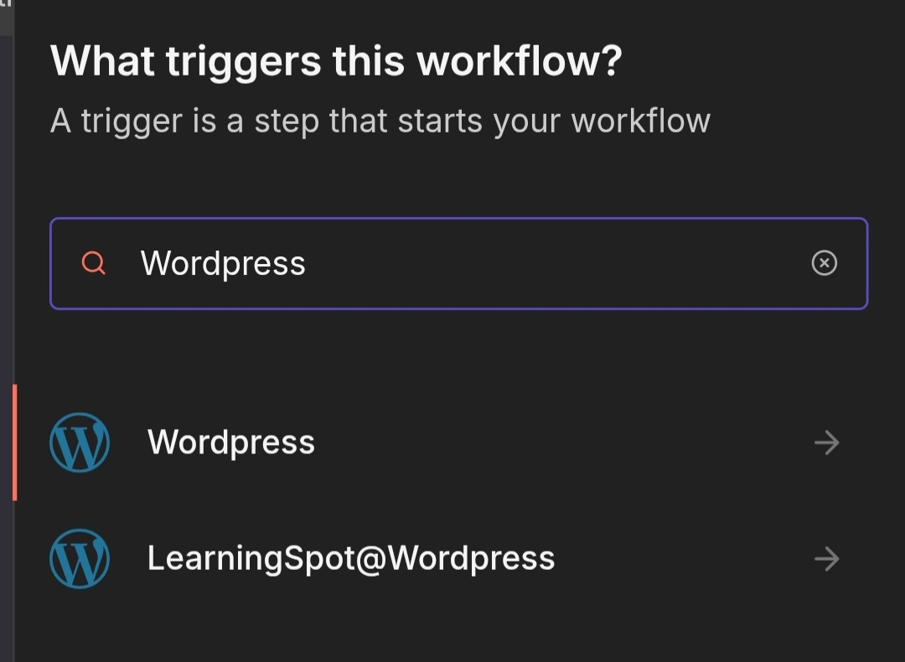
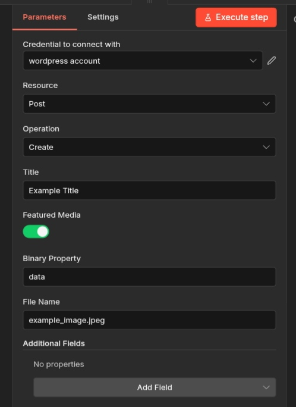
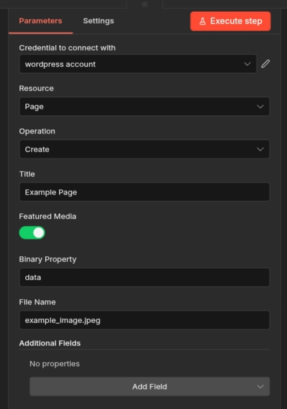
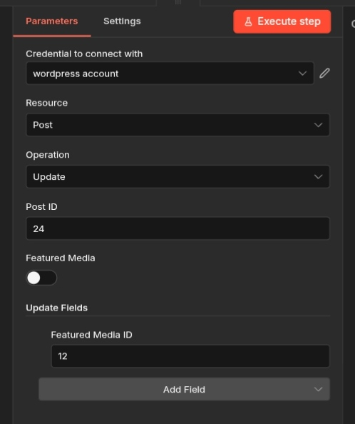
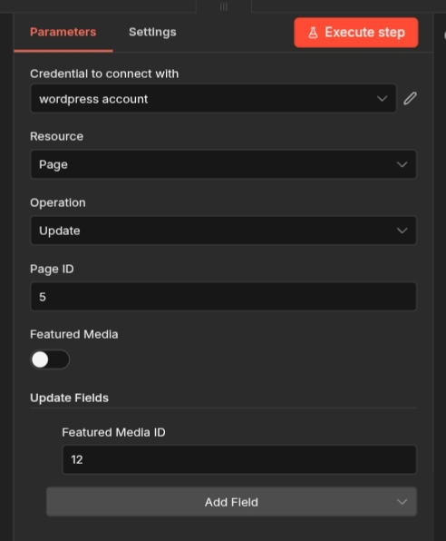
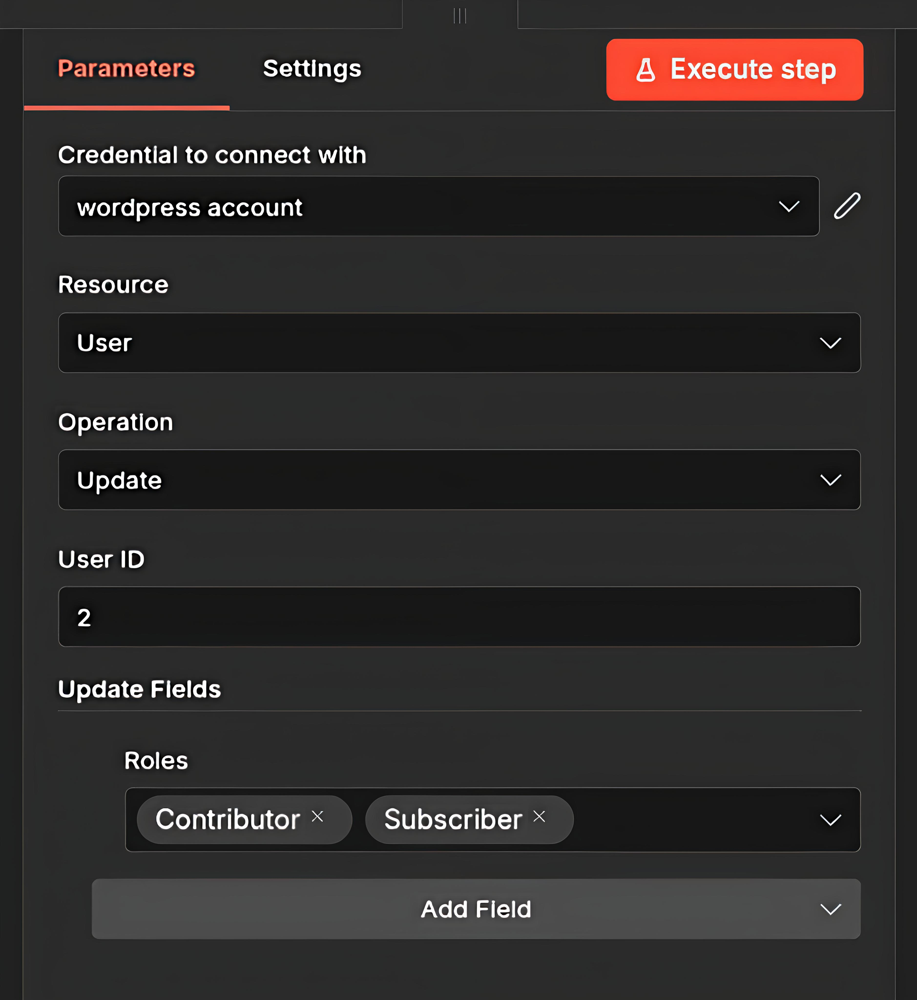

# n8n-nodes-wordpress

**Extended Wordpress nodes for n8n** – The most powerful community node for WordPress automation.

This package adds advanced Post, Page, and User operations to n8n with features that the official WordPress node does not provide (binary image handling with automatic sanitization & attachment, multi-role user support, etc.).

Node Display Name : LearningSpot@Wordpress


---

## ✨ Features

### Post & Page

#### Create
- Create a new **Post** or **Page**
- Set **featured media** directly from:
  - Binary image data (uploaded via n8n)
  - Existing Wordpress Media ID

#### Update
- Update an existing **Post** or **Page**
- Update **featured media** from binary data **or** existing Media ID

Featured Media With Binary Data :



Featured Media With Media ID :



#### Binary Image Handling (Behind the Scenes)
When you pass binary image data, the node automatically does the following:

1. **Sanitize** the image filename (removes unsupported characters, spaces, special symbols)
2. **Upload** the image to the Wordpress Media Library
3. **Retrieve** the newly created Media ID
4. **Attach** the image as the featured media of the Post/Page
5. **Link** the Post/Page back to the image (complete two-way relationship)

### User
- Extended **Create User** and **Update User** operations
- Assign **multiple roles** at once (e.g., `editor,author,subscriber`)
- Default role is **Subscriber** if none is provided


---

## Prerequisites

Before you begin, install the following on your **development machine** (or the machine where you will run the deployment script):

### Required

- **[Node.js](https://nodejs.org/)** (v22 or higher) + pnpm
  - **Linux / macOS / WSL**: Install via [nvm](https://github.com/nvm-sh/nvm)
  - **Windows**: Follow [Microsoft's official Node.js guide](https://learn.microsoft.com/en-us/windows/dev-environment/javascript/nodejs-on-windows)
- **[git](https://git-scm.com/downloads)**

---

## Installation

### Docker Installation (Recommended)

#### 1. Using Script (Recommended)

```bash
# 1. Clone the repository
git clone https://github.com/LearningSpot/n8n-nodes-wordpress.git
cd n8n-nodes-wordpress

# 2. Check your n8n volume name
docker volume list
# Example output: n8n_data, n8n_storage, etc.

# 3. Create custom folder (replace n8n_storage with your volume name)
sudo mkdir -p /var/lib/docker/volumes/n8n_storage/_data/custom

# 4. Edit the deploy script (replace volume name inside the script)
nano .deploy-node.sh

# 5. Make executable and run
chmod +x .deploy-node.sh
node -v   # Must show v22 or higher
./.deploy-node.sh
```

The script will automatically:
- Install dependencies
- Build the node
- Copy files to the correct n8n custom folder
- Restart n8n (if container name is `n8n`)

#### 2. Manual Docker Installation

```bash
# Clone the repository
git clone https://github.com/LearningSpot/n8n-nodes-wordpress.git
cd n8n-nodes-wordpress

# Check your n8n volume name
docker volume list  # Example output: n8n_data, n8n_storage, etc.

# Create target folder (replace n8n_storage with your volume)
sudo mkdir -p /var/lib/docker/volumes/n8n_storage/_data/custom/n8n-nodes-wordpress

node -v   # Ensure v22 or higher

pnpm install
pnpm run build

sudo cp -r dist/* /var/lib/docker/volumes/n8n_storage/_data/custom/n8n-nodes-wordpress

# Restart your n8n container
docker restart n8n   # Change name if your container is called differently
```

---

### n8n Host (Non-Docker) Installation

Follow either of the installation methods above, but **change the destination path** to match your host installation.

Typical locations:
- `~/.n8n/custom/n8n-nodes-wordpress` (default host install)
- `/root/.n8n/custom/n8n-nodes-wordpress` (if running as root)
- Whatever path you configured with `N8N_CUSTOM_EXTENSIONS` env variable

After copying the `dist/` contents, **restart n8n**.

---

## After Installation

1. Restart n8n (if not done automatically)
2. Open n8n → Search for **"LearningSpot@Wordpress"** in the nodes palette
3. You will now see the enhanced nodes:
   - **WordPress Post**
   - **WordPress Page**
   - **WordPress User**

All original operations are still available + the new extended features.

---

## Contributing

Pull requests are welcome!  
Feel free to open an issue if you find a bug or have a feature request.

---

## License

MIT License – see [LICENSE](LICENSE) file.

---

**Made with ❤️ for the n8n & WordPress communities**  
Repository: https://github.com/LearningSpot/n8n-nodes-wordpress

